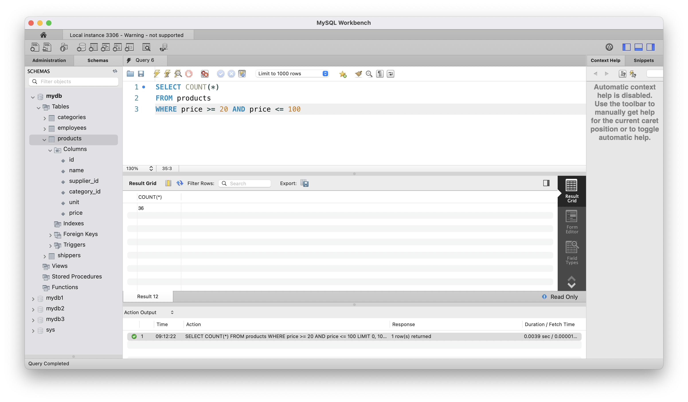

# goit-rdb-hw-03

# Опис завданнь:

## Завдання 1

Напишіть SQL команду, за допомогою якої можна:

- вибрати всі стовпчики (За допомогою wildcard “\*”) з таблиці products;
- вибрати тільки стовпчики name, phone з таблиці shippers,
  та перевірте правильність її виконання в MySQL Workbench.

## Розвязання завдання 1

```sql
SELECT * FROM products
```


```sql
SELECT name, phone FROM shippers
```


## Завдання 2

Напишіть SQL команду, за допомогою якої можна знайти середнє, максимальне та мінімальне значення стовпчика price таблички products, та перевірте правильність її виконання в MySQL Workbench*.*

## Розвязання завдання 2

```sql
SELECT AVG(price) AS average_price,
MAX(price) AS max_price,
MIN(price) AS min_price
FROM products
```


## Завдання 3

Напишіть SQL команду, за допомогою якої можна обрати унікальні значення колонок category_id та price таблиці products.

Оберіть порядок виведення на екран за спаданням значення price та виберіть тільки 10 рядків. Перевірте правильність виконання команди в MySQL Workbench.

## Розвязання завдання 3

```sql
SELECT DISTINCT category_id, price
FROM products
ORDER BY price DESC
LIMIT 10
```


## Завдання 4

Напишіть SQL команду, за допомогою якої можна знайти кількість продуктів (рядків), які знаходиться в цінових межах від 20 до 100, та перевірте правильність її виконання в MySQL Workbench.

## Розвязання завдання 4

```sql
SELECT COUNT(*)
FROM products
WHERE price >= 20 AND price <= 100
```



## Завдання 5

Напишіть SQL команду, за допомогою якої можна знайти кількість продуктів (рядків) та середню ціну (price) у кожного постачальника (supplier_id), та перевірте правильність її виконання в MySQL Workbench.

## Розвязання завдання 5

```sql
SELECT supplier_id,
COUNT(*) AS product_count,
AVG(price) AS average_price
FROM products
GROUP BY supplier_id
```


